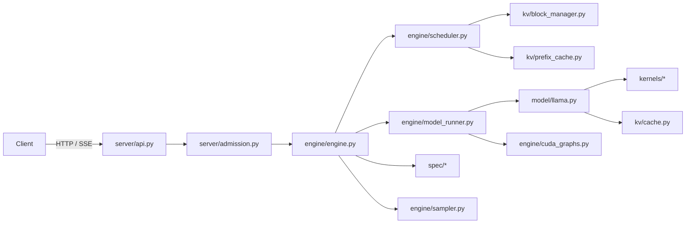

# TinyServe: Build Specification for Coding Agents

> This document is the single source of truth for building TinyServe. It is written for AI coding agents (Claude Code and Codex) working with a human owner who will read, review, and learn from every line of code. Read the whole document before starting any task. Re-read Section 3 (Agent Rules) at the start of every session.

---

## Table of Contents

1. Project Overview
2. Goals, Non-Goals, and Honesty Constraints
3. Agent Rules (read every session)
4. Multi-Agent Workflow (Claude Code + Codex)
5. Tech Stack and Environment
6. Hardware Strategy
7. Architecture
8. Repository Layout
9. Core Data Structures and Tensor Layouts
10. Metrics Definitions
11. Benchmarking Methodology
12. Testing Strategy
13. Phased Build Plan (with tasks and acceptance criteria)
14. Research Study Design
15. Learning Support for the Human Owner
16. Risks and Known Pitfalls
17. Glossary
18. Appendix A: CLAUDE.md and AGENTS.md contents
19. Appendix B: PROGRESS.md template
20. Appendix C: Reference papers and projects

---

## 1. Project Overview

TinyServe is a small, readable LLM inference serving engine built from scratch in Python, PyTorch, and Triton. It serves a Llama-architecture model on a single GPU through an OpenAI-compatible streaming API.

It implements, one phase at a time:

- A from-scratch Llama model implementation that loads Hugging Face safetensors weights
- A paged KV cache with a block manager and prefix caching
- Continuous batching with chunked prefill and preemption
- Custom Triton kernels (paged decode attention, fused RMSNorm, RoPE, INT8 weight-only GEMM)
- CUDA graph capture for decode
- Speculative decoding with a draft model and exact rejection sampling
- INT8 weight-only quantization
- An online server with SSE streaming and SLA-aware admission control
- A benchmarking and profiling harness that compares TinyServe to vLLM on identical workloads
- A research study comparing speculative decoding policies under load

**Why it exists.** The owner is targeting ML inference / ML systems roles. The project must demonstrate deep, first-hand understanding of KV caching, memory layout, attention kernels, batching, serving, profiling, speculative decoding, and quantization. Readability and measured results matter more than raw performance.

**Target models.**

| Role | Final model | Development model |
|---|---|---|
| Target | `meta-llama/Llama-3.1-8B-Instruct` | `meta-llama/Llama-3.2-1B-Instruct` |
| Draft (speculative) | `meta-llama/Llama-3.2-1B-Instruct` | Target `Llama-3.2-3B-Instruct` with draft `Llama-3.2-1B-Instruct` |

All four share the Llama 3 tokenizer, which is required for speculative decoding. Llama models are gated on Hugging Face: the human must accept the license and provide an HF token. Model choice must be config-driven so any Llama-architecture checkpoint works.

---

## 2. Goals, Non-Goals, and Honesty Constraints

### Goals

1. Correctness first: outputs must match the Hugging Face reference implementation within defined tolerances.
2. Readability: a strong engineer should understand any module in under 15 minutes.
3. Measurability: every optimization must be benchmarked before and after, with raw results committed.
4. Competitive but not dominant: aim for 50 to 80 percent of vLLM throughput on the same hardware and workload. Explaining the gap is part of the deliverable.
5. Each phase ends in a working, tested, committed state.

### Non-Goals

- Multi-GPU, tensor parallelism, pipeline parallelism
- Non-Llama architectures (MoE, Mamba, encoder-decoder) in the core scope
- Beam search, LoRA serving, guided decoding
- Production hardening (auth, rate limiting per API key, multi-tenant isolation)
- Beating vLLM or SGLang

### Honesty Constraints (non-negotiable)

1. **Never fabricate, estimate, or "fill in" benchmark numbers.** Every number in any doc, README, commit message, or plot must come from a script run in this repo, with its raw output file committed under `docs/results/`.
2. **Never claim novelty.** The research study is a reproduction and comparison of published ideas. Cite them.
3. **Do not copy code** from vLLM, SGLang, Nano-vLLM, gpt-fast, FlashInfer, or other projects. Reading them for understanding is allowed. If an idea is taken from a project, record it in `docs/REFERENCES.md` with a link and a one-line description of what was borrowed conceptually.
4. If a result is disappointing, report it as it is. A negative result with a clear explanation is valuable.
5. If a test is flaky or a tolerance had to be loosened, document why in `docs/DECISIONS.md`. Never loosen a tolerance silently to make a test pass.

---

## 3. Agent Rules (read every session)

### Session start

1. Read this spec's Section 3, then `docs/PROGRESS.md` (latest entries first), then `docs/DECISIONS.md`.
2. Identify the next unclaimed task from Section 13. Tasks are done in order within a phase unless the task says otherwise.
3. State in one short paragraph what you will do this session and which files you expect to touch.

### While working

1. **One task at a time.** Do not start a second task until the first meets its acceptance criteria.
2. **Small diffs.** Prefer many small commits. A single commit should rarely exceed 400 changed lines.
3. **Tests with code.** Every new module gets unit tests in the same commit.
4. **Run the tests** (`uv run pytest -m "not gpu"` always; `uv run pytest -m gpu` when a GPU is available) before committing.
5. **No new dependencies** without recording the reason in `docs/DECISIONS.md`.
6. **Readability rules:**
   - Every tensor-producing line in model, kernel, and engine code gets a shape comment, e.g. `# [num_tokens, num_heads, head_dim]`.
   - Every function has a docstring explaining *why* it exists, not just what it does.
   - No metaprogramming, no deep inheritance hierarchies, no clever abstractions. Plain functions and small dataclasses.
   - Keep files under roughly 400 lines. Split by responsibility if larger.
   - Name things after the concept in the literature (`block_table`, `slot_mapping`, `num_computed_tokens`).
7. **Correctness before speed.** Every optimized path (Triton kernel, CUDA graph, quantized GEMM) must have a slow, obviously correct PyTorch reference in `tinyserve/kernels/reference.py` or next to it, and a test comparing the two.
8. If you are unsure about a design decision that affects more than one module, write the options into `docs/DECISIONS.md` under "Open questions" and ask the human instead of guessing.

### Session end

1. Append an entry to `docs/PROGRESS.md` using the template in Appendix B.
2. If the task finished, write or update the learning note for it in `docs/learn/` (see Section 15).
3. Commit with a message of the form `P<phase>.<task>: <short description>`.
4. Leave the repo in a state where all non-GPU tests pass.

### Forbidden

- Editing benchmark result files by hand
- Deleting or skipping tests to make CI pass
- Writing README claims that are not backed by a committed result file
- Committing model weights, HF tokens, or large datasets (use `.gitignore` and download scripts)

---

## 4. Multi-Agent Workflow (Claude Code + Codex)

Two agents may work on this repo. To avoid conflicts:

1. **Branch per task:** `p<phase>-<task>-<slug>`, e.g. `p3-2-block-manager`. Merge to `main` only when acceptance criteria pass.
2. **Claim tasks in PROGRESS.md** before starting: add a line `CLAIMED P3.2 by <agent> on <date>`.
3. **Never have both agents editing the same module at the same time.**
4. **Recommended split of roles** (the human may override):
   - Implementer agent: writes the module and its basic tests.
   - Reviewer agent: reviews the diff against this spec, writes adversarial tests (edge cases, off-by-one in block boundaries, empty batches, max lengths), and checks shape comments and docstrings.
   - Swap roles between phases so both agents see the whole codebase.
5. **Review checklist for the reviewer agent:**
   - Does it match the spec's data structures and naming?
   - Is there a reference implementation and a comparison test?
   - Are edge cases tested (sequence length exactly a multiple of block size, length 1 prompts, empty waiting queue, out-of-blocks)?
   - Could the human understand this from the code plus the learning note?
   - Are any numbers in docs backed by result files?

---

## 5. Tech Stack and Environment

| Area | Choice | Notes |
|---|---|---|
| Language | Python 3.11 | |
| Env / packaging | `uv` with `pyproject.toml` | Pin exact versions once the environment works; record in DECISIONS.md |
| Tensor library | PyTorch 2.x (latest stable with CUDA support on the target machine) | |
| Kernels | Triton (version bundled with the chosen PyTorch) | Optional single CUDA C++ kernel via `torch.utils.cpp_extension` in a stretch task |
| Weights | `safetensors` loaded directly | Hugging Face `transformers` used only as a correctness reference and for the tokenizer / chat template |
| Tokenizer | `transformers.AutoTokenizer` | |
| Server | FastAPI + uvicorn, SSE streaming | OpenAI-compatible `/v1/completions` and `/v1/chat/completions` |
| HTTP client for load tests | `httpx` async or `aiohttp` | |
| Testing | `pytest` with markers `gpu`, `slow` | |
| Lint / format | `ruff` (lint and format) | |
| Profiling | `torch.profiler`, Nsight Systems (`nsys`), Nsight Compute (`ncu`) | |
| Microbenchmarks | `triton.testing.do_bench` | |
| Plotting | `matplotlib` | Plots generated only from committed result files |
| Baseline | `vllm` installed in a **separate** virtual environment | Avoids dependency conflicts with TinyServe |
| Datasets | ShareGPT (filtered), WikiText-2 (perplexity), a code prompt set (e.g. HumanEval prompts) | Downloaded by script, never committed |

Environment rules:

- `scripts/env_info.py` prints GPU name, driver, CUDA, PyTorch, Triton, and Python versions. Its output is embedded in every benchmark result file.
- Default dtype is `bfloat16` on GPUs that support it, else `float16`. Tests on CPU use `float32`.

---

## 6. Hardware Strategy

The human's GPU access may vary. Design for this:

1. **CPU-only development must work** for all non-kernel logic. Use a tiny randomly initialized Llama config (`tests/fixtures/tiny_llama.json`: 2 layers, hidden 64, 4 query heads, 2 KV heads, head_dim 16, vocab 256) for unit tests.
2. **Small GPU (8 to 24 GB):** develop with `Llama-3.2-1B-Instruct`; speculative decoding with 3B target and 1B draft.
3. **Large GPU (A100 40/80 GB or H100):** final benchmarks with `Llama-3.1-8B-Instruct`.
4. All model paths, dtypes, block sizes, memory fractions, and batch limits come from a config object (`tinyserve/config.py`), overridable by CLI flags.
5. Every result file records the GPU model. Never compare numbers across different GPUs.

Memory planning reference for Llama-3.1-8B in bf16:

- Weights: about 16 GB
- KV cache per token: 32 layers x 8 KV heads x 128 head_dim x 2 (K and V) x 2 bytes = 131,072 bytes (128 KiB)
- So each 1 GB of free memory holds about 8,000 tokens of KV cache

---

## 7. Architecture



### Request lifecycle

1. The API receives a request, tokenizes it, and creates a `Sequence`.
2. Admission control decides: admit, queue with a deadline, or reject (HTTP 503).
3. The scheduler, once per engine step, builds a `ScheduledBatch`: decode tokens for running sequences first, then prefill chunks from waiting sequences, within a token budget and the available KV blocks.
4. The block manager allocates blocks; the prefix cache reuses blocks whose token content was already computed.
5. The model runner flattens the batch into 1-D tensors (`input_ids`, `positions`, `slot_mapping`, plus attention metadata) and runs the model. Decode-only batches use captured CUDA graphs.
6. The sampler produces next tokens. With speculative decoding enabled, the drafter proposes tokens and the verifier accepts or rejects them.
7. New tokens are streamed back to the client. Finished sequences release their blocks (blocks with prefix-cache entries stay cached until evicted).

### Engine loop and threading

- The engine loop runs in a dedicated background thread (phase 7). It communicates with the async API layer through thread-safe queues.
- Stretch goal: move the engine to a separate process if Python GIL contention shows up in profiles. Record the evidence in DECISIONS.md before doing this.

---

## 8. Repository Layout

```
tinyserve/
  pyproject.toml
  README.md
  CLAUDE.md                  # short pointer to docs/SPEC.md (Appendix A)
  AGENTS.md                  # same content, for Codex (Appendix A)
  docs/
    SPEC.md                  # this document
    PROGRESS.md              # session log (Appendix B)
    DECISIONS.md             # design decisions, open questions, loosened tolerances
    REFERENCES.md            # papers and projects consulted
    learn/                   # learning notes, one per task or concept
    results/                 # raw benchmark JSONL + generated plots
    writeup/                 # final technical write-up
  tinyserve/
    config.py
    model/
      llama.py               # model definition
      weights.py             # safetensors loading and name mapping
      rope.py                # RoPE incl. Llama 3 frequency scaling
      tokenizer.py
    kv/
      cache.py               # KV cache tensors and memory profiling
      block_manager.py       # block allocation, block tables, ref counts
      prefix_cache.py        # hash-based prefix caching and LRU eviction
    engine/
      sequence.py            # Sequence, SequenceStatus, SamplingParams
      scheduler.py           # continuous batching, chunked prefill, preemption
      model_runner.py        # batch flattening, attention metadata, forward
      cuda_graphs.py
      sampler.py             # greedy, temperature, top-k, top-p
      engine.py              # step loop, offline generate() API
    kernels/
      reference.py           # slow, correct PyTorch versions of everything
      paged_attention.py     # Triton paged decode attention
      prefill_attention.py   # prefill path (reference first, Triton stretch)
      rmsnorm.py             # Triton fused add + RMSNorm
      rope.py                # Triton RoPE
      kv_store.py            # write new K/V into paged cache
      w8a16_gemm.py          # Triton INT8 weight-only GEMM
    spec/
      drafter.py             # draft model proposal
      verify.py              # rejection sampling verification
      policies.py            # speculation length policies (study)
      cost_model.py          # step-time model for goodput policies
    quant/
      int8.py                # weight quantization and packing
    server/
      api.py
      protocol.py            # OpenAI request/response schemas
      admission.py
  bench/
    offline.py               # fixed request set, max throughput
    serving.py               # Poisson-arrival load generator against any OpenAI endpoint
    datasets.py              # ShareGPT / code prompt loading and filtering
    vllm_baseline.md         # exact commands used to run vLLM
    plots.py
    microbench/              # kernel microbenchmarks
  eval/
    parity.py                # logits / greedy-output parity vs HF
    perplexity.py            # WikiText-2 perplexity
  scripts/
    env_info.py
    download_models.sh
    download_datasets.sh
    profile_nsys.sh
    profile_ncu.sh
  tests/
    fixtures/tiny_llama.json
    unit/
    gpu/
```

---

## 9. Core Data Structures and Tensor Layouts

These are the contracts between modules. Changing them requires a DECISIONS.md entry.

### Sequence (`engine/sequence.py`)

```python
@dataclass
class SamplingParams:
    temperature: float = 1.0      # 0.0 means greedy
    top_p: float = 1.0
    top_k: int = -1               # -1 means disabled
    max_tokens: int = 256
    seed: int | None = None
    stop_token_ids: list[int] = field(default_factory=list)

class SequenceStatus(Enum):
    WAITING, RUNNING, PREEMPTED, FINISHED

@dataclass
class Sequence:
    seq_id: int
    prompt_token_ids: list[int]
    output_token_ids: list[int]
    sampling_params: SamplingParams
    status: SequenceStatus
    num_computed_tokens: int      # tokens whose KV is already in the cache
    block_table: list[int]        # physical block ids, in logical order
    arrival_time: float
    first_token_time: float | None
    # speculative decoding stats
    num_draft_tokens_proposed: int = 0
    num_draft_tokens_accepted: int = 0
```

### KV cache (`kv/cache.py`)

Per layer, two tensors:

```
k_cache[layer]: [num_blocks, block_size, num_kv_heads, head_dim]
v_cache[layer]: [num_blocks, block_size, num_kv_heads, head_dim]
```

- Default `block_size = 16`.
- A token at logical position `p` of a sequence lives in physical block `block_table[p // block_size]` at offset `p % block_size`.
- `slot_mapping[i] = block_id * block_size + offset` for each new token `i` in the flattened batch. The KV store kernel writes to `k_cache.view(-1, num_kv_heads, head_dim)[slot_mapping]`.

Number of blocks is set by memory profiling at startup:

1. Load weights.
2. Run one forward pass with the maximum configured batch token count to measure peak activation memory.
3. `kv_bytes = total_gpu_memory * gpu_memory_utilization - weights - peak_activations`.
4. `num_blocks = kv_bytes // bytes_per_block`.

### Block manager (`kv/block_manager.py`)

- Free list of block ids.
- Reference count per block.
- `can_allocate(seq, num_new_tokens) -> bool`
- `allocate(seq, num_new_tokens)` appends blocks to `seq.block_table` as needed.
- `free(seq)` decrements ref counts; blocks at zero return to the free list, or to the prefix cache's evictable pool if they are cached.
- `truncate(seq, new_length)` frees blocks beyond `new_length` (needed for speculative decoding rollback).

### Prefix cache (`kv/prefix_cache.py`)

- Only **full** blocks are cached.
- Block hash = hash of `(parent_block_hash, tuple(token_ids_in_block))`. The chain makes the hash depend on the whole prefix.
- Map `hash -> block_id`. When a new sequence arrives, walk its prompt block by block; reuse matching blocks (increment ref count) and set `num_computed_tokens` accordingly.
- Blocks with ref count 0 that are cached go into an LRU evictable pool and are reclaimed when the free list is empty.
- Always recompute at least the last prompt token, so there are logits to sample from.
- Copy-on-write is **not** required for prefix caching of full blocks. It is only needed if parallel sampling (`n > 1`) is added later; that is out of scope unless a stretch task adds it.

### Scheduled batch (`engine/scheduler.py` to `engine/model_runner.py`)

```python
@dataclass
class ScheduledSeq:
    seq: Sequence
    num_new_tokens: int           # 1 for decode, chunk length for prefill
    is_prefill: bool

@dataclass
class ScheduledBatch:
    seqs: list[ScheduledSeq]
    num_batched_tokens: int
    preempted: list[Sequence]
```

### Model runner input (flattened)

```
input_ids:     [num_tokens]            int64
positions:     [num_tokens]            int64
slot_mapping:  [num_tokens]            int64
# attention metadata
query_start_loc: [num_seqs + 1]        int32   prefix sums of query lengths
seq_lens:        [num_seqs]            int32   total context length after this step
block_tables:    [num_seqs, max_blocks] int32  padded with -1 or 0 (document which)
logits_indices:  [num_seqs]            int64   index of the last token of each seq (for sampling)
```

Only the logits at `logits_indices` are computed through the LM head (saves memory and time).

---

## 10. Metrics Definitions

Use exactly these definitions everywhere.

| Metric | Definition |
|---|---|
| TTFT | Time from request arrival at the server to the first output token sent to the client |
| TPOT | Mean time between consecutive output tokens for one request, excluding the first token: `(e2e_latency - ttft) / (num_output_tokens - 1)` |
| ITL | Individual inter-token latencies (report p50, p99; used to detect stalls) |
| E2E latency | Arrival to last token |
| Output throughput | Total output tokens / wall-clock time of the run |
| Total throughput | (Prompt + output tokens) / wall-clock time |
| Goodput | Requests per second that meet all SLOs (e.g. TTFT <= X ms and TPOT <= Y ms) |
| SLO attainment | Fraction of requests meeting all SLOs |
| KV memory waste | (Allocated KV slots - used KV slots) / allocated KV slots, sampled each step |
| Acceptance rate | Accepted draft tokens / proposed draft tokens |
| Mean accepted length | Mean number of tokens emitted per target verification step (includes the bonus token) |
| Achieved bandwidth | Bytes read + written by a kernel / kernel time |
| Bandwidth utilization | Achieved bandwidth / GPU peak memory bandwidth (peak taken from the vendor spec sheet, cited in the result file) |
| Perplexity | exp(mean negative log-likelihood) on WikiText-2 test, fixed context length and stride recorded |

Report latency percentiles as p50, p90, p99. Never report only means.

---

## 11. Benchmarking Methodology

1. **Same client for everything.** `bench/serving.py` hits an OpenAI-compatible endpoint. It is used against both TinyServe and `vllm serve`, so the measurement path is identical.
2. **Workloads:**
   - `sharegpt`: real conversations, filtered to prompt length <= 1024 and output length <= 1024 tokens, fixed random subset with a fixed seed.
   - `code`: code-completion prompts (higher draft acceptance expected).
   - `shared_prefix`: many requests sharing a long system prompt (tests prefix caching).
   - `synthetic`: fixed input/output lengths for controlled sweeps.
3. **Arrival process:** Poisson arrivals at a given request rate; sweep rates from light load to saturation. Also an "all at once" offline mode for max throughput.
4. **Fixed output lengths** in comparisons with vLLM: set `max_tokens` from the dataset and ignore EOS (`ignore_eos` on the vLLM side; equivalent flag in TinyServe) so both engines generate the same number of tokens.
5. **Warmup:** discard the first N requests (default 10) or run a separate warmup pass.
6. **Repeats:** 3 runs per configuration; report the median run and the spread.
7. **Settings parity with vLLM:** same model, dtype, max batch size, max model length, and prefix caching setting. Record exact vLLM commands and version in `bench/vllm_baseline.md`.
8. **Result files:** each run writes one JSONL file to `docs/results/<phase>/<date>_<name>.jsonl` containing: config, env_info output, git commit hash, per-request records, and summary metrics.
9. **Plots** are generated only by `bench/plots.py` from result files.

### Profiling workflow

1. `torch.profiler` for an overall breakdown of one engine step (CPU vs GPU time, kernel list).
2. `scripts/profile_nsys.sh` for timelines: look for GPU idle gaps (CPU overhead, synchronization).
3. `scripts/profile_ncu.sh` for individual kernels: achieved bandwidth, occupancy.
4. Every optimization task records a before profile and an after profile summary in its learning note.

---

## 12. Testing Strategy

### Test layers

1. **Unit tests (CPU, tiny model):** block manager, prefix cache hashing, scheduler decisions, batch flattening, sampler, rejection sampling statistics, RoPE scaling math.
2. **Parity tests:** TinyServe model vs Hugging Face model.
   - CPU, float32, tiny random model: max absolute logit difference < 1e-4.
   - GPU, bf16, real 1B model: greedy decoding of 64 tokens on 10 fixed prompts; require the first 32 tokens to match exactly on at least 9 of 10 prompts, and report max logit difference. bf16 numerics differ with batch shape, so exact long-horizon matches are not guaranteed; document observed behavior.
3. **Kernel tests (GPU):** each Triton kernel vs its reference over a grid of shapes, including edge cases (context length 1, exact multiples of block size, one past a multiple, max length, GQA group sizes 1 and 4). Tolerances: bf16 `atol=1e-2, rtol=1e-2` unless justified otherwise in DECISIONS.md.
4. **Engine tests:** batched generation must produce the same greedy outputs as one-at-a-time generation (CPU float32 exact; GPU high match rate as above).
5. **Speculative decoding tests:**
   - Greedy speculative output equals greedy non-speculative output exactly on CPU float32 with the tiny model.
   - Rejection sampling correctness: on toy distributions `p` (target) and `q` (draft), sample 100,000 times; the empirical output distribution must match `p` (chi-square test, p-value > 0.01).
6. **Server tests:** streaming returns well-formed SSE chunks, request cancellation frees blocks, admission control rejects when predicted TTFT exceeds the SLO.

Markers: `@pytest.mark.gpu` for GPU tests, `@pytest.mark.slow` for tests over 30 seconds.

---

## 13. Phased Build Plan

There is no fixed timeline. The human works on this as time allows. Each phase ends in a stable, tested state and a **resume checkpoint** describing what can honestly be claimed at that point.

Task format: ID, description, acceptance criteria.

---

### Phase 0: Repository and Environment

**P0.1 Project skeleton.** Create the layout in Section 8, `pyproject.toml` with `uv`, `ruff` config, pytest markers, `.gitignore` (weights, datasets, `.env`, results larger than 5 MB).
*Accept:* `uv run pytest` runs (with zero or placeholder tests) and `uv run ruff check` passes.

**P0.2 Docs scaffolding.** Create `docs/PROGRESS.md`, `docs/DECISIONS.md`, `docs/REFERENCES.md`, `docs/learn/README.md`, and `CLAUDE.md` / `AGENTS.md` from Appendix A. Copy this spec to `docs/SPEC.md`.
*Accept:* files exist and follow the templates.

**P0.3 Environment scripts.** `scripts/env_info.py`, `scripts/download_models.sh` (reads `HF_TOKEN` from environment), `scripts/download_datasets.sh`.
*Accept:* `env_info.py` prints all fields on CPU and GPU machines.

**P0.4 Config.** `tinyserve/config.py` with dataclasses for model, cache, scheduler, speculative, server, and benchmark settings, plus CLI override support.
*Accept:* unit test loads defaults and applies overrides.

**P0.5 CI.** GitHub Actions workflow running ruff and non-GPU tests.
*Accept:* CI passes on `main`.

---

### Phase 1: Correct Model and Naive Generation

**P1.1 Tokenizer wrapper.** Load tokenizer, apply chat template, encode and decode, streaming-safe incremental detokenization (handles multi-byte characters split across tokens).
*Accept:* round-trip tests; incremental detokenization test with non-ASCII text.

**P1.2 RoPE.** Implement rotary embeddings including the Llama 3 frequency scaling (`rope_type: "llama3"` with `factor`, `low_freq_factor`, `high_freq_factor`, `original_max_position_embeddings` read from the model config). Precompute cos/sin caches.
*Accept:* matches HF's rotary embedding outputs within 1e-5 in float32.

**P1.3 Llama model.** `model/llama.py`: embedding, decoder layers (RMSNorm, GQA attention, SwiGLU MLP), final norm, LM head (respect tied embeddings if the config says so). First version uses a simple contiguous per-sequence KV cache and `torch.nn.functional.scaled_dot_product_attention`.
*Accept:* CPU float32 parity with HF on the tiny random model (< 1e-4).

**P1.4 Weight loading.** `model/weights.py` loads safetensors shards and maps HF parameter names to TinyServe names. Loads directly to the target device and dtype.
*Accept:* loads Llama-3.2-1B; GPU parity test from Section 12 passes.

**P1.5 Sampler.** Greedy, temperature, top-k, top-p, per-request seeds.
*Accept:* unit tests for each mode; seeded sampling is reproducible.

**P1.6 Naive engine.** `engine.generate(prompts, sampling_params)` processing requests one at a time with the contiguous cache.
*Accept:* generates coherent text; parity with HF greedy output.

**Resume checkpoint 1:** "Implemented Llama 3 inference from scratch in PyTorch with numerical parity to Hugging Face." (Not yet resume-worthy alone; foundation.)

---

### Phase 2: Benchmark and Profiling Harness

**P2.1 Datasets.** `bench/datasets.py` loads and filters ShareGPT, code prompts, shared-prefix, and synthetic workloads with fixed seeds.
*Accept:* deterministic subsets; unit tests on filtering.

**P2.2 Offline benchmark.** `bench/offline.py` runs a fixed request set through the engine's Python API and records throughput and per-request latency.
*Accept:* produces a JSONL result file in the Section 11 format.

**P2.3 Baselines.** Record naive TinyServe and Hugging Face `generate` baselines on the dev model.
*Accept:* committed result files; short note in `docs/learn/` explaining where time goes (use `torch.profiler`).

**P2.4 vLLM baseline setup.** Separate venv, `bench/vllm_baseline.md` with exact commands and version.
*Accept:* vLLM runs on the dev model; offline result recorded.

**P2.5 Profiling scripts.** `scripts/profile_nsys.sh` and `scripts/profile_ncu.sh` wrappers with documented usage.
*Accept:* produce reports on the naive engine; findings summarized in a learning note.

---

### Phase 3: Paged KV Cache

**P3.1 KV cache allocation and memory profiling.** `kv/cache.py` per Section 9.
*Accept:* reports number of blocks and KV capacity in tokens at startup; unit test with fake memory numbers.

**P3.2 Block manager.** Allocation, free, ref counts, truncate.
*Accept:* unit tests including exhaustion, exact block boundaries, and truncate.

**P3.3 KV store.** Write new K/V to the paged cache via `slot_mapping` (PyTorch indexing first).
*Accept:* test that values land in the correct block and offset.

**P3.4 Reference paged attention.** In `kernels/reference.py`: gather K/V from pages using block tables, then standard attention. Supports query length 1 (decode) and query length > 1 over a cached prefix (chunked prefill and speculative verification).
*Accept:* matches contiguous-cache attention exactly in float32.

**P3.5 Switch the model to paged KV.** Model runner builds flattened inputs and attention metadata (Section 9).
*Accept:* all parity tests still pass.

**P3.6 Prefix cache.** Hash chain, reuse, LRU eviction.
*Accept:* unit tests; on the `shared_prefix` workload, computed prompt tokens drop as expected; measure TTFT change and commit results.

**P3.7 Memory waste measurement.** Instrument allocated vs used slots; compare with a contiguous max-length allocation strategy.
*Accept:* result file with both numbers.

---

### Phase 4: Continuous Batching and Chunked Prefill

**P4.1 Scheduler.** Waiting and running queues, per-step token budget (`max_num_batched_tokens`) and sequence limit (`max_num_seqs`). Decodes are scheduled first, then prefill chunks fill the remaining budget.
*Accept:* unit tests for budget accounting, ordering, chunk splitting.

**P4.2 Preemption.** When blocks run out, preempt the most recently arrived running sequence, free its blocks, and requeue it for recomputation.
*Accept:* a test that forces block exhaustion completes all requests correctly.

**P4.3 Engine step loop.** `engine.step()` = schedule, run, sample, update, free finished.
*Accept:* batched greedy outputs equal one-at-a-time outputs (Section 12).

**P4.4 Benchmark.** Offline and Poisson-rate sweeps on the dev model vs naive engine and vLLM.
*Accept:* result files and plots; learning note on the throughput-latency trade-off and the effect of chunk size on p99 ITL.

**Resume checkpoint 2:** paged KV cache, prefix caching, continuous batching with chunked prefill, with measured memory waste reduction, concurrency gain, and throughput vs vLLM.

---

### Phase 5: Triton Kernels

**P5.1 Fused add + RMSNorm.** Residual add and RMSNorm in one kernel.
*Accept:* correctness vs reference; microbenchmark vs PyTorch; bandwidth utilization reported.

**P5.2 RoPE kernel.** Applies rotary embedding to Q and K in place using positions.
*Accept:* correctness and microbenchmark.

**P5.3 Paged decode attention.** One program per (sequence, KV head); processes all query heads in that KV head's GQA group; loops over the block table; online softmax in float32; writes output in the model dtype.
*Accept:* correctness over the shape grid in Section 12; microbenchmark vs reference and vs FlashAttention/FlashInfer decode if available (comparison only, not a dependency); bandwidth utilization reported; before/after engine benchmark.

**P5.4 Split-K decode (stretch).** Flash-decoding style partitioning of long contexts across programs with a reduction step.
*Accept:* speedup demonstrated for long contexts at small batch sizes, or a documented negative result.

**P5.5 Prefill attention (stretch).** Triton causal attention for query chunks over a paged prefix. Until then, the reference gather + SDPA path is used for prefill. Using `flash_attn`'s paged API for prefill is acceptable as an interim measure if recorded in DECISIONS.md, but the decode kernel must be TinyServe's own.
*Accept:* correctness; benchmark vs interim path.

**P5.6 KV store kernel (optional).** Triton version of the `slot_mapping` write if profiling shows the PyTorch indexing path is significant.

---

### Phase 6: CUDA Graphs

**P6.1 Decode graph capture.** Capture decode-only forward passes for batch-size buckets (1, 2, 4, 8, 16, 32, 64, ...). Pad batches up to the nearest bucket. Use static input buffers.
*Accept:* identical outputs with and without graphs; nsys timelines before and after showing reduced CPU launch gaps; benchmark at batch 1 and batch 32.

**P6.2 Fallback rules.** Mixed prefill/decode batches run eagerly. Document the policy.

**Resume checkpoint 3:** custom Triton kernels with measured bandwidth utilization, CUDA graphs, profiling-driven optimization, throughput vs vLLM on the 8B model (final GPU).

---

### Phase 7: Online Server and SLA-Aware Admission

**P7.1 OpenAI-compatible API.** `/v1/completions` and `/v1/chat/completions`, streaming (SSE) and non-streaming, `max_tokens`, `temperature`, `top_p`, `stop`, `seed`, and an `ignore_eos` extension for benchmarking.
*Accept:* works with the official `openai` Python client; server tests pass.

**P7.2 Engine thread and cancellation.** Background engine loop; client disconnect aborts the sequence and frees its blocks.
*Accept:* test that disconnect frees blocks.

**P7.3 Serving benchmark.** `bench/serving.py` against TinyServe and vLLM with identical workloads and rate sweeps.
*Accept:* result files; TTFT/TPOT/goodput plots.

**P7.4 Admission control.** Predict TTFT for a new request from: queued prefill tokens ahead of it, measured prefill throughput (EMA), and current step time. If predicted TTFT exceeds the SLO, reject with 503 (policy A) or queue with deadline and drop if the deadline passes (policy B).
*Accept:* goodput and SLO attainment compared for FIFO, policy A, and policy B across load levels; learning note.

**Resume checkpoint 4:** streaming OpenAI-compatible serving with SLA-aware admission control, measured p99 TTFT/TPOT and goodput vs FIFO.

---

### Phase 8: Speculative Decoding

**P8.1 Draft model runner.** Second model instance (the 1B draft) with its own paged KV cache sharing the block manager design (separate block pool). Memory profiling accounts for both models.
*Accept:* draft model generates correctly on its own.

**P8.2 Proposal.** For each decoding sequence, run `k` draft decode steps (batched across sequences), recording draft token probabilities `q`.
*Accept:* unit tests on shapes and stored probabilities.

**P8.3 Verification.** Target model processes `k + 1` query tokens per sequence over the paged cache (reuses the chunked-prefill attention path). Apply rejection sampling:
- Accept draft token `x` with probability `min(1, p(x) / q(x))`.
- On first rejection, sample from `normalize(max(0, p - q))` and stop.
- If all `k` accepted, sample one bonus token from `p` at the last position.
- Greedy mode: accept while draft token equals target argmax.
*Accept:* Section 12 speculative tests (exact greedy equality on CPU, chi-square distribution test).

**P8.4 KV rollback.** After verification, truncate both target and draft sequences to the accepted length (`block_manager.truncate`). Slots beyond the accepted length are simply overwritten later; fully unused blocks are freed.
*Accept:* tests on rollback at block boundaries.

**P8.5 Integration with scheduler.** Speculation applies to decode sequences; token budget accounts for `k + 1` tokens per speculating sequence. CUDA graphs may be disabled for verification steps in the first version (document it).
*Accept:* end-to-end correctness; acceptance statistics logged per request.

**P8.6 Benchmark.** Static `k` in {0, 2, 4, 6} across batch sizes and request rates, on `sharegpt` and `code` workloads.
*Accept:* result files; plot of speedup vs batch size showing where speculation stops helping.

---

### Phase 9: INT8 Weight-Only Quantization

**P9.1 Quantization.** Per-output-channel symmetric INT8 for all linear layers except the LM head and embeddings (configurable). Store INT8 weights and fp16/bf16 scales.
*Accept:* dequantized weights match originals within expected error; unit tests.

**P9.2 W8A16 GEMM kernel.** Triton kernel that dequantizes in-register and multiplies with bf16 activations. Optimize for small M (decode) first.
*Accept:* correctness vs dequantize-then-matmul reference; microbenchmarks vs bf16 `torch.matmul` for M in {1, 8, 32, 128, 512}.

**P9.3 Quality evaluation.** `eval/perplexity.py` on WikiText-2 for bf16 and INT8.
*Accept:* result file with both perplexities and settings.

**P9.4 Engine integration and benchmark.** Config flag to enable INT8 for target, draft, or both.
*Accept:* throughput/latency results; memory saved; learning note.

**Resume checkpoint 5:** speculative decoding with exact rejection sampling and INT8 weight-only quantization, with measured acceptance, speedup across load levels, memory saved, and perplexity impact.

---

### Phase 10: Research Study (see Section 14)

**P10.1** Implement policies. **P10.2** Cost model. **P10.3** Experiment runner. **P10.4** Analysis and plots. **P10.5** Write-up draft.
Acceptance criteria are defined in Section 14.

---

### Phase 11: Write-Up and Open Source (human-led, agents assist)

**P11.1 README.** Architecture diagram, how to run, feature list, and a results table generated from result files only.

**P11.2 Technical write-up.** `docs/writeup/tinyserve.md`: motivation, design, each optimization with before/after data, comparison with vLLM with an honest gap analysis, study results, limitations.

**P11.3 Upstream contribution (human-led).** The human picks a small issue in vLLM or SGLang (docs, benchmark scripts, tests, small bugs). Agents may help investigate but the human must understand and submit the PR themselves.

---

## 14. Research Study Design

### Question

How should speculative decoding length be chosen as serving load changes, and how do published adaptive policies compare when implemented in the same engine and measured on the same hardware and workloads?

### Framing

This is a **reproduction and head-to-head comparison**, not a new method. Prior work includes SmartSpec (goodput-based speculation length), AdaSpec (per-request, SLO-aware speculation length), and Nightjar (bandit-based length selection and draft offloading). Cite them in the write-up. Do not describe any policy here as novel unless the human has done a literature review and recorded it in DECISIONS.md.

### Policies (`spec/policies.py`)

| ID | Policy | Description |
|---|---|---|
| P0 | Off | No speculation |
| P1 | Static | Fixed `k` in {2, 4, 6} |
| P2 | Batch threshold | Speculate with fixed `k` only when running batch size < threshold |
| P3 | Goodput (SmartSpec-style) | Estimate per-request acceptance with an EMA; use a step-time cost model; pick batch-level `k` maximizing expected tokens per second |
| P4 | Per-request (AdaSpec-style) | Choose `k` per request from its acceptance estimate and the batch cost model |

All policies share one interface:

```python
class SpecPolicy(Protocol):
    def choose_k(self, batch_state: BatchState) -> dict[int, int]:
        """Return speculation length per seq_id for this step (0 disables)."""
```

### Cost model (`spec/cost_model.py`)

Fit a simple model of step time as a function of batched tokens and total context length from profiling runs (e.g. linear regression). Validate its prediction error on held-out runs and report it.

### Experiment matrix

- Workloads: `sharegpt`, `code`
- Request rates: sweep from light load to saturation (at least 6 points)
- Metrics: output throughput, p50/p99 TPOT, p99 TTFT, goodput under a fixed SLO, acceptance rate
- 3 repeats per point, median reported

### Acceptance criteria

- All policies pass correctness tests (outputs remain distributionally identical to the target model).
- One result file per (policy, workload, rate, repeat).
- Plots: throughput vs rate, p99 TPOT vs rate, goodput vs rate, chosen `k` over time for P3 and P4.
- Write-up section answering: where does each policy win, where does it lose, and why (with profiles).

### Optional extension (only after the human's literature check)

Study how INT8 quantization of the target and/or draft changes acceptance rates and the best policy. Record in DECISIONS.md whether prior work already covers this before claiming anything about it.

---

## 15. Learning Support for the Human Owner

The human is using this project to learn. Code alone is not enough.

For every completed task, the agent writes or updates `docs/learn/<phase>-<task>-<topic>.md` containing:

1. **Concept in plain words** (under 200 words), with a small concrete example (e.g. a 3-sequence batch with actual block ids).
2. **Where it lives in the code:** file paths and function names, in reading order.
3. **Key tensors and shapes** as they flow through the task's code.
4. **What was measured** and the result file path (if any).
5. **Pitfalls hit during implementation** and how they were fixed.
6. **Five self-check questions** the human should be able to answer in an interview, e.g. "Why does prefix caching only cache full blocks?" Include short answers in a collapsed `<details>` block.

### Human review gates

Before starting the next phase, the human should be able to explain, without notes:

- After Phase 1: the Llama forward pass, GQA, RoPE scaling.
- After Phase 3: block tables, slot mapping, why paging reduces fragmentation, prefix hashing.
- After Phase 4: how the scheduler fills a step, chunked prefill's effect on tail latency, preemption.
- After Phase 5: why decode is memory-bound, how the paged decode kernel iterates, online softmax, how bandwidth utilization is computed.
- After Phase 6: what CUDA graphs remove and why they need static shapes.
- After Phase 7: TTFT vs TPOT vs goodput, how admission control predicts TTFT.
- After Phase 8: why rejection sampling preserves the target distribution, why speculation helps less at large batch sizes.
- After Phase 9: why weight-only quantization speeds up decode but not prefill as much.

Agents should not start a new phase until the human confirms the gate in PROGRESS.md.

---

## 16. Risks and Known Pitfalls

| Risk | Mitigation |
|---|---|
| bf16 nondeterminism breaks exact-match tests | Exact tests on CPU float32; GPU tests use match-rate thresholds and logit-difference reporting |
| Llama 3 RoPE scaling implemented wrong (silent quality loss at long context) | Dedicated parity test vs HF at positions beyond 8192 |
| Off-by-one at block boundaries | Explicit tests at lengths `n * block_size - 1`, `n * block_size`, `n * block_size + 1` |
| Prefix cache returns stale blocks after eviction | Remove hash entry on eviction; test reuse after eviction |
| Memory profiling underestimates activations, OOM under load | Profile with maximum batched tokens; keep a safety margin configurable |
| CPU overhead dominates small-batch decode | Profile with nsys early; CUDA graphs in Phase 6; keep Python work per step minimal |
| Unfair vLLM comparison | Identical client, model, dtype, limits, and prefix-caching settings; commands recorded |
| Scope creep | Non-goals list in Section 2; stretch tasks are optional |
| Agents drift from spec | Session-start rules; reviewer agent checklist |
| Human falls behind in understanding | Learning notes and review gates in Section 15 |

---

## 17. Glossary

- **KV cache:** stored keys and values from previous tokens so they are not recomputed each step.
- **Block / page:** fixed-size chunk of KV cache holding `block_size` tokens for one sequence.
- **Block table:** per-sequence list mapping logical block index to physical block id.
- **Slot mapping:** per-token physical slot index where new K/V are written.
- **Prefill:** processing prompt tokens (compute-heavy, many tokens per sequence).
- **Decode:** generating one token per sequence per step (memory-bandwidth-bound).
- **Chunked prefill:** splitting long prompts across steps so decodes are not stalled.
- **Continuous batching:** sequences join and leave the batch every step.
- **Preemption:** evicting a running sequence's KV when memory runs out and recomputing later.
- **GQA:** grouped-query attention; several query heads share one KV head.
- **Online softmax:** computing softmax incrementally over chunks with a running max and sum.
- **Speculative decoding:** a draft model proposes tokens; the target model verifies them in parallel.
- **Rejection sampling:** the acceptance rule that keeps speculative outputs distributed exactly like the target model.
- **W8A16:** 8-bit weights, 16-bit activations.
- **SLO / SLA:** latency targets a serving system commits to.
- **Goodput:** throughput counting only requests that meet their SLOs.

---

## 18. Appendix A: CLAUDE.md and AGENTS.md contents

Create both files at the repo root with this content:

```markdown
# TinyServe agent instructions

The full specification is in docs/SPEC.md. It is the source of truth.

At the start of every session:
1. Read docs/SPEC.md Section 3 (Agent Rules).
2. Read the latest entries in docs/PROGRESS.md and all of docs/DECISIONS.md.
3. Pick the next unclaimed task from docs/SPEC.md Section 13 and claim it in PROGRESS.md.

Hard rules:
- Never fabricate or hand-edit benchmark numbers. Numbers come only from committed result files.
- Never copy code from vLLM, SGLang, Nano-vLLM, or other projects. Record conceptual borrowing in docs/REFERENCES.md.
- Every optimized path needs a reference implementation and a comparison test.
- Shape comments on tensor code, docstrings explaining why.
- Run `uv run pytest -m "not gpu"` before every commit.
- End every session with a PROGRESS.md entry and, for finished tasks, a docs/learn/ note.
- Do not start a new phase until the human has confirmed the review gate in PROGRESS.md.
```

---

## 19. Appendix B: PROGRESS.md template

```markdown
## <YYYY-MM-DD> | <agent: Claude Code / Codex> | Task P<x>.<y>

**Status:** in progress / done / blocked
**What changed:** files touched and a two-line summary
**Tests:** which tests were added, and pass/fail status (CPU and GPU)
**Results:** result file paths, if any (no numbers without a file)
**Decisions:** links to DECISIONS.md entries, if any
**Next step:** the exact next action for whoever continues
**Questions for the human:** anything needing a decision
```

Review gate confirmation format (written by the human):

```markdown
## <YYYY-MM-DD> | HUMAN | Gate after Phase <n> passed
```

---

## 20. Appendix C: Reference Papers and Projects

Read for understanding; do not copy code. Add entries to `docs/REFERENCES.md` as they are used.

**Papers**

- Kwon et al., "Efficient Memory Management for Large Language Model Serving with PagedAttention" (vLLM, SOSP 2023)
- Yu et al., "Orca: A Distributed Serving System for Transformer-Based Generative Models" (iteration-level scheduling, OSDI 2022)
- Agrawal et al., "Sarathi-Serve" (chunked prefill and stall-free scheduling, OSDI 2024)
- Dao et al., FlashAttention and FlashAttention-2; the Flash-Decoding blog post
- Leviathan et al., "Fast Inference from Transformers via Speculative Decoding" (ICML 2023)
- Chen et al., "Accelerating Large Language Model Decoding with Speculative Sampling" (2023)
- Liu et al., "Optimizing Speculative Decoding for Serving Large Language Models Using Goodput" (SmartSpec, 2024)
- "AdaSpec: Adaptive Speculative Decoding for Fast, SLO-Aware Large Language Model Serving" (SoCC 2025)
- "Nightjar: Dynamic Adaptive Speculative Decoding for Large Language Models Serving" (2025)
- Zhong et al., "DistServe" (goodput and SLO framing, OSDI 2024)
- Zheng et al., "SGLang" (RadixAttention prefix caching)

**Projects (reference reading only)**

- vLLM, SGLang, Nano-vLLM, PyTorch gpt-fast, FlashInfer, Triton tutorials (fused softmax, matmul, layer norm)
